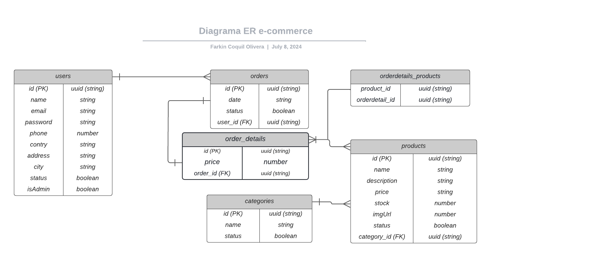

<p align="center">
  <a href="http://nestjs.com/" target="blank"></a>
</p>

[circleci-image]: https://img.shields.io/circleci/build/github/nestjs/nest/master?token=abc123def456
[circleci-url]: https://circleci.com/gh/nestjs/nest

  <p align="center">A progressive <a href="http://nodejs.org" target="_blank">Node.js</a> framework for building efficient and scalable server-side applications.</p>
    <p align="center">


## Description

> Es una aplicacion del lado del back-end para un ecommerce, usando tecnologias como Typescript, TypeORM, postgresql, cloudinary para subir        archivos de formatos de imagen, etc entre las principales y asu vez estos trabjando en el framework de NESTJS.

> La aplicacion cuenta con las configuraciones para trabajar en docker compose y asi tambien se hizo un deploy mediante render.

> La demo se encuentra en:
  - [Demo app] (https://pm4be-deploy.onrender.com/api)

## DER de la BBDD

  

## Installation

```bash
$ npm install
```

## Running the app

```bash
# development
$ npm run start

# watch mode
$ npm run start:dev
```

## Support (Bibliografia usada para el proyecto)

> Nest is an MIT-licensed open source project. It can grow thanks to the sponsors and support by the amazing backers. If you'd like to join them, please [read more here](https://docs.nestjs.com/support).

> Docker desktop para Linux y sus dependencias [read more here] (https://docs.docker.com/desktop/install/ubuntu/)

> Typeorm para la conexion con la BBDD [read more here] (https://typeorm.io/entities#simple-array-column-type)

> Openapi para la carga de arhivos [read more here] (https://docs.nestjs.com/openapi/operations#file-upload)

> Swagger para la documentacion de la aplicacion [read more here] (https://swagger.io/specification/)

etc..
